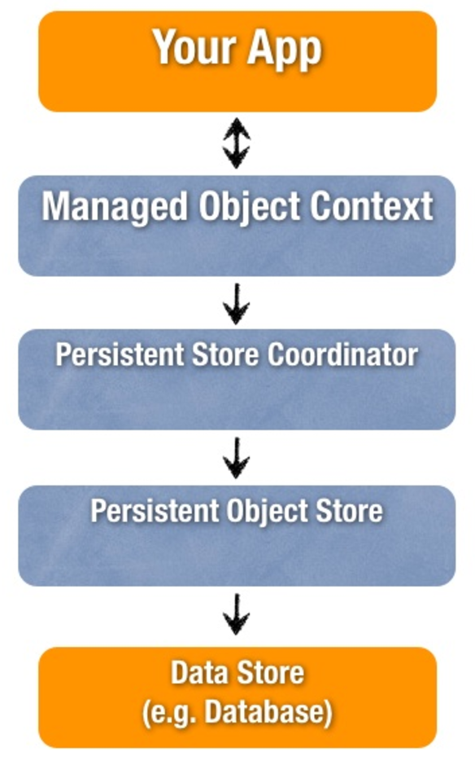
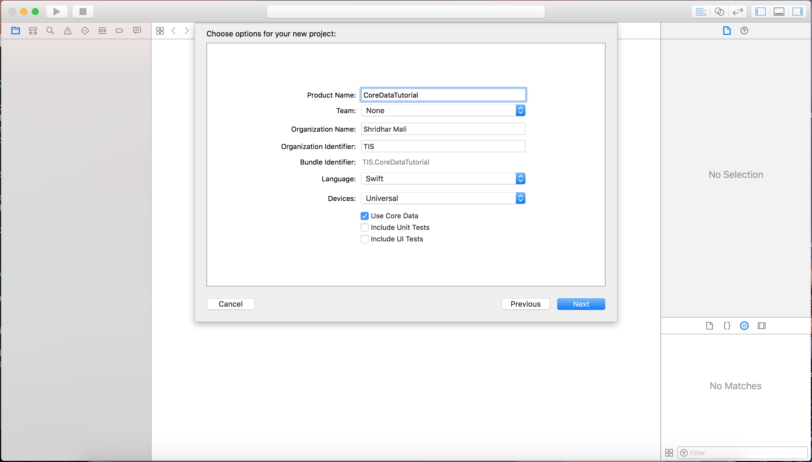

## Core Data

- Core data is not a database, It is a framework that lets developers store or retrive data in database in object oriented way.

- Sqlite is the default persistant store of core data.

- Core data support following persistant stores.
  1. NSSqliteStoreType
  2. NSXMLStoreType
  3. NSBinaryStoreType
  4. NSInMemoryStoreType
- Core data is not a relational databse.

## Core Data Stack

### Managed Object Context 

- Its job is to manage objects created & returned using core data.
- Whenever you need to fetch, save, edit & delete object in persistant store **Context** is the first component you talk to. 
- It is a scratch pad containing objects that interacts with data in persistant store.

### Persistant Store Coordinator

- SQLite is different persistant store in core data.
- Core data allows developers to set ups multiple store containing different entities.
- Persistant store coordinator is partly responsible to manage persistant object store & save the objects to store.

### Managed Object Model

- It describes the schema that you uses in the app.
- Schema is represented by collection of objects (Also known as entities)
- Managed Object Model is defined in a file with the extension **.xcdatamodeld**
- You can use visual editor to define the entities & their attributes as well as relationships.

## Steps to create core data example

1) Open Xcode -> File -> New -> Project -> Select Single View Application Template -> Name it **CoreDataTutorial** select **Use Core Data** checkbox

  